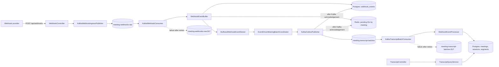
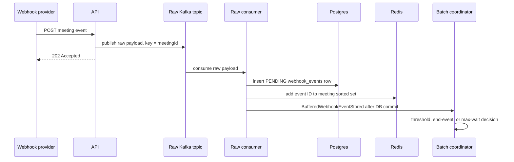

# Meeting Webhook Service: Architecture Design

## 1. Purpose

This service accepts meeting lifecycle and transcript webhooks, buffers them safely, batches them per meeting, and produces a live transcript for each meeting session.

The deployed pipeline is Kafka-first. A webhook is acknowledged quickly and processed asynchronously.

## 2. System overview



## 3. Package structure

```text
api/          HTTP controllers and API exceptions
config/       thread pools, Kafka retry/DLT and topic configuration
domain/entity JPA entities (database tables)
domain/enums  persistence state enums
event/        in-process Spring event records
model/        request/response transport records
queue/        Kafka producers, consumers, and batch message model
redis/        Redis pending-event index
repository/   Spring Data JPA repositories
service/      buffering, batching, and transcript processing logic
```

## 4. Components

| Component | Responsibility |
|---|---|
| `WebhookController` | Validates the HTTP payload and returns `202 Accepted`. |
| `KafkaWebhookIngressPublisher` | Serializes an accepted `WebhookPayload` and publishes it to the raw Kafka topic using `meetingId` as the key. |
| `KafkaWebhookConsumer` | Consumes raw Kafka messages and calls `WebhookEventBuffer`. |
| `WebhookEventBuffer` | Persists a raw event in Postgres, indexes its ID in Redis, and emits an internal after-commit event. |
| `EventDrivenMeetingBatchCoordinator` | Decides when a meeting's pending events should be flushed. |
| `KafkaOutboxPublisher` | Publishes a ready batch to Kafka and removes its source events from the pending buffer after producer acknowledgement. |
| `KafkaTranscriptBatchConsumer` | Consumes ready transcript batches, applies idempotency, and invokes the processor. |
| `WebhookEventProcessor` | Creates/updates meetings, sessions, transcript segments, and the stored full transcript. |
| `TranscriptQueryService` | Reads the stored full transcript and ordered transcript segments. |
| `PendingEventIndex` | Maintains Redis sorted sets of pending event IDs; falls back to a Postgres count when Redis is disabled or unavailable. |

## 5. Webhook ingestion flow



`BufferedWebhookEventStored` is an in-process Spring event. It is emitted only after the buffer transaction commits, so a rolled-back event cannot be batched.

## 6. Batching behavior

Batching is per `meetingId`.

A flush occurs when one of these conditions is met:

- pending count reaches `webhook.batch.size-threshold` (default: `10`);
- a `meeting.ended` event arrives;
- the first pending event has waited `webhook.batch.max-wait-ms` (default: `100 ms`).

The coordinator keeps one in-memory timer and one lock per meeting. The timer schedules only a short callback; `webhookBatchExecutor` performs database and Kafka work separately.

```text
new event stored
  -> threshold/end: flush immediately
  -> otherwise: schedule one max-wait timer

flush
  -> load that meeting's PENDING rows in received-time order
  -> publish one MeetingTranscriptBatch
```

## 7. Storage model

| Store | Data | Purpose |
|---|---|---|
| Postgres `webhook_events` | Raw pending events | Durable buffer before batch publication. |
| Redis sorted set `webhook:pending:{meetingId}` | Pending event IDs ordered by received time | Fast per-meeting pending count and index. |
| Postgres `meeting` | Meeting metadata | Shared meeting data. |
| Postgres `meeting_sessions` | Session state and `full_transcript` | One run of a meeting. |
| Postgres `transcript_segment` | Ordered transcript pieces | Source data/audit trail for the transcript. |
| Postgres `processed_kafka_batches` | Completed batch IDs | Consumer idempotency. |

`Session.fullTranscript` is a materialized live snapshot. Each accepted segment is stored individually and then the session snapshot is rebuilt in sequence-number order. The API returns the stored snapshot plus segments.

## 8. Kafka topics, partitions, and ordering

| Topic | Producer | Consumer group | Purpose |
|---|---|---|---|
| `meeting-webhooks-raw` | `KafkaWebhookIngressPublisher` | `meeting-webhook-inbox` | Raw ingress pipeline. |
| `meeting-transcript-batches` | `KafkaOutboxPublisher` | `meeting-transcript-processor` | Ready batch processing. |
| `meeting-webhooks-raw.DLT` | Error handler | Manual investigation/replay | Permanently failed raw records. |
| `meeting-transcript-batches.DLT` | Error handler | Manual investigation/replay | Permanently failed transcript batches. |

The producer key is `meetingId`. Kafka assigns equal keys to the same partition, preserving event order for a meeting. The deployed topics have three partitions and each listener has concurrency three, allowing different meetings to be processed in parallel.

Sessions under the same meeting are intentionally serialized because they share the `meetingId` key. If sessions must scale independently, use a composite `meetingId:sessionId` key after reviewing meeting-level ordering requirements.

## 9. Failure handling

### Producer-side batch publication

Kafka producer settings use `acks=all`, idempotence, and three producer retries.

If the batch still cannot be published:

1. `KafkaOutboxPublisher` throws an exception.
2. Its Postgres transaction rolls back; buffered rows and Redis pending IDs remain.
3. `EventDrivenMeetingBatchCoordinator` schedules a retry for the same meeting after `webhook.batch.publish-retry-delay-ms` (default: `1000 ms`).
4. The retry reuses a deterministic batch ID built from buffered event IDs.

A stable batch ID makes a publish/cleanup crash safe: if Kafka accepted the first publish but database cleanup did not commit, a duplicate message has the same ID and is skipped after successful processing.

### Consumer-side failure and DLT

`KafkaFailureHandlingConfiguration` installs a Spring Kafka `DefaultErrorHandler`:

```text
listener error
  -> retry 3 times, with configured backoff
  -> publish original record to <source-topic>.DLT
  -> commit the recovered source offset
```

The DLT is durable but is not automatically replayed. An operator should inspect, correct the cause, and republish a valid record when appropriate.

## 10. Idempotency and transactions

- The batch consumer checks `processed_kafka_batches` before processing.
- It saves the batch ID only after every event in the batch succeeds.
- A processing exception rolls back the database transaction and leaves the Kafka offset uncommitted until the error handler recovers it.
- Duplicate successfully processed batches are skipped.

Kafka provides at-least-once delivery; the application provides idempotent final processing rather than assuming exactly-once delivery.

## 11. Configuration

Key values in `application-kafka.yml`:

```yaml
webhook:
  batch:
    size-threshold: 10
    max-wait-ms: 100
    publish-retry-delay-ms: 1000
  kafka:
    partitions: 3
    raw-consumer-concurrency: 3
    batch-consumer-concurrency: 3
    consumer-retry-attempts: 3
    consumer-retry-delay-ms: 1000
```

Docker activates the `kafka` Spring profile. Database credentials are supplied through `.env`; `.env` is ignored by Git and `.env.example` is the safe template.

## 12. Testing

`WebhookIntegrationTest` is the single Kafka-backed integration test class.

- `@EmbeddedKafka` starts temporary raw, batch, and DLT topics.
- `MockMvc` submits real HTTP webhook requests.
- The real Kafka consumers, buffer, coordinator, publishers, and processor run.
- Tests assert database state, transcript API JSON, sequence ordering, duplicate delivery, and DLT routing for failed batches.

Run all tests:

```powershell
mvn test
```

## 13. Operational considerations

- Redis is an optimization, not the source of truth; Postgres is the durable pending buffer.
- Timers and per-meeting locks are in application memory. A future startup recovery job should scan old `PENDING` rows and resubmit them after a process restart.
- DLT records require monitoring and a documented replay procedure.
- Replication factor is currently one for local Docker. Production Kafka should use replication greater than one.